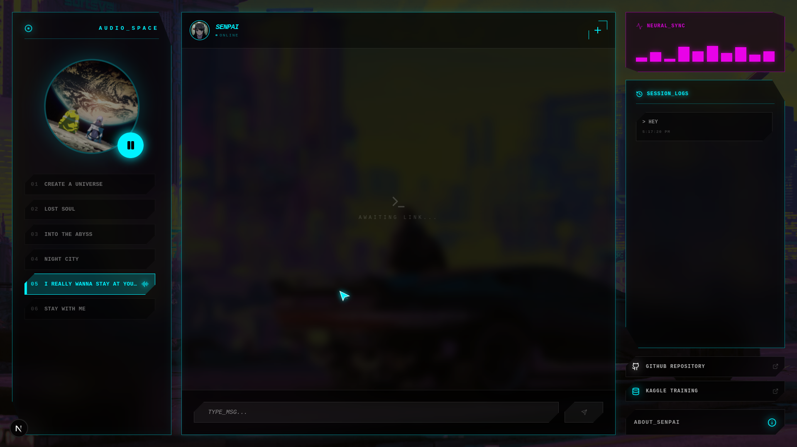

# Amadeus

[](https://nextjs.org/)
[](https://huggingface.co/meta-llama/Meta-Llama-3-8B)
[](https://huggingface.co)
[](https://tailwindcss.com/)

Let’s be real standard AI has zero aura. It’s too polite, too robotic, and honestly? Just mid. So I decided to cook something different. I took 12k+ real world WhatsApp messages from my friend “senpai” and basically fine tuned her entire personality into a Llama-3 8B model, Trained it on Kaggle , used Hugging face as backend and nextjs as frontend.

You can explore the project here:

**Live Website:**  
https://senpai-chatbot.vercel.app/

**Kaggle Training Notebook:**  
https://www.kaggle.com/code/hamnamubarak/amadeus/edit

**
---
<p align="center">
  
</p>

## Training Pipeline

The model was trained through several stages of dataset preparation and fine-tuning.

### 1. Dataset Preparation
- Raw WhatsApp exports containing **~81,000 lines**
- Cleaned and structured into **12,613 dialogue samples**
- Applied **Consecutive Message Grouping** to preserve natural paragraph style conversation

### 2. Fine-Tuning

Training was performed using **Unsloth**, which enables efficient LLM fine-tuning.

Configuration highlights:

- **Base Model:** Llama-3 8B
- **Training Framework:** Unsloth
- **Learning Rate:** `5e-5`
- **Training Steps:** `1000`
- **Sequence Length:** `2048`
- **Hardware:** Kaggle GPU T2x2 

The training loss decreased from approximately **2.5 → 0.3**, 

### 3. Model Export

After training, the model was exported in **GGUF format (Q4_K_M quantization)**.

---

## Tools Used

### Frontend 

- **Next.js 15** – React framework for UI
- **Tailwind CSS** – Cyberpunk themed styling
- **Framer Motion** – Animations and transitions
- **Lucide React** – Icon system

### Backend 

- **FastAPI** – Python API server
- **Llama-3B** – as Base model
- **Hugging Face Spaces** – For hosting environment

---


## Getting Started

### Installation

1. **Clone the repo**
   ```bash
   git clone https://github.com/lilithCode/Senpai-Chatbot.git
   cd Amadeus-RAG
   ```

2. **Install frontend dependencies**
   ```bash
   npm install
   # or
   yarn
   ```

## Environment Variables

- HF_TOKEN — Hugging Face API token


Production build:
```bash
npm run build
npm run start
```

## Contributing

Contributions welcome. Please open issues or PRs with focused changes. For model/training changes include reproducible steps and resource usage :)

---
